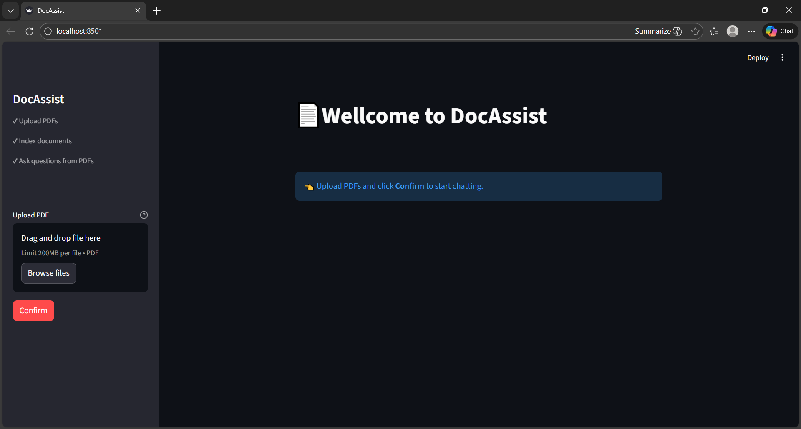

# DocAssist

## Tech Stack

<p align="center">
  
  
  
  
  
  
  
</p>


# 🍳 Overview
DocAssist is a document-based question answering system built using Retrieval-Augmented Generation (RAG).
It enables users to upload documents (PDFs) and interact with them using natural language queries.
Instead of relying on generic LLM knowledge, DocAssist retrieves relevant document chunks and generates responses strictly grounded in the uploaded content, reducing hallucinations and improving answer accuracy.
<br>

# 📌 Problem Statement
Large documents are difficult to manually search and understand.
Traditional keyword-based search fails to capture semantic meaning, and generic LLMs cannot reliably answer questions about private documents.

# ❔ Solution
DocAssist solves this by combining vector-based semantic search with large language models.
Relevant document sections are retrieved using embeddings and passed as context to the LLM, ensuring responses are accurate, explainable, and source-aware.

# 🔑 Key Features
1.  Upload and process PDF documents
2.  Semantic search using vector embeddings
3.  Context-aware question answering
4.  Reduced hallucination through retrieval grounding
5.  Modular RAG pipeline (ingestion, retrieval, generation)
6.  Scalable design for future extensions

## 👩‍💻 Tech Stack
| Layer | Technology |
|------|-----------|
| Language | Python |
| LLM | Groq [LLaMa] |
| RAG Framework | LangChain |
| Embeddings | Sentence Transformers |
| Vector DB | Chroma DB |
| Document Loader | PyPDFLoader |
| UI | Streamlit |
| Dev Tools | Git, venv |

## ⚒ How it works ?

1. **Document Upload**  
   User uploads a PDF document through the interface.

2. **Chunking & Embedding**  
   The document is split into smaller chunks and converted into vector embeddings.

3. **Vector Storage**  
   Embeddings are stored in a vector database for efficient cosine similarity search.

4. **User Query**  
   User asks a natural language question.

5. **Semantic Retrieval**  
   Relevant document chunks are retrieved based on vector similarity.

6. **Context Injection**  
   Retrieved chunks are passed as context to the LLM.

7. **Answer Generation**  
   The LLM generates a response grounded strictly in the document content.

## 📐Architecture Overview

```text
┌──────────┐
│   User   │
└────┬─────┘
     ↓
┌──────────┐
│    UI    │  (Streamlit)
└────┬─────┘
     ↓
┌──────────────┐
│ Query Engine │
│ (Retriever)  │
└────┬─────────┘
     ↓
┌──────────────┐
│  Vector DB   │  (Chroma DB)
└────┬─────────┘
     ↓
┌────────────────┐
│ Context Builder│
│ (Top-K Chunks) │
└────┬───────────┘
     ↓
┌──────────┐
│   LLM    │  (Groq)
└────┬─────┘
     ↓
┌──────────┐
│  Answer  │
└──────────┘
```
## 🔗 Product Overview
<p align="center">
  
</p>
